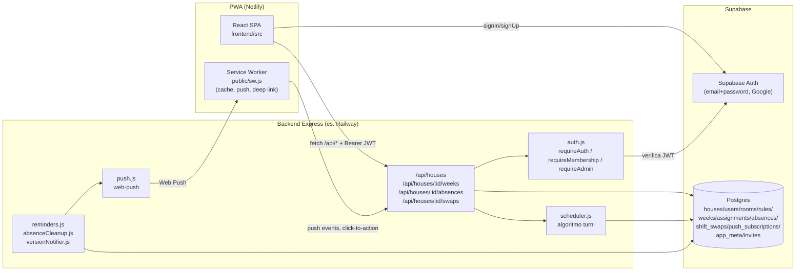
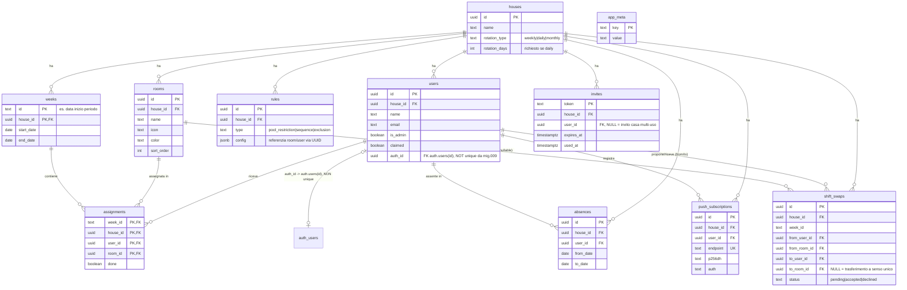
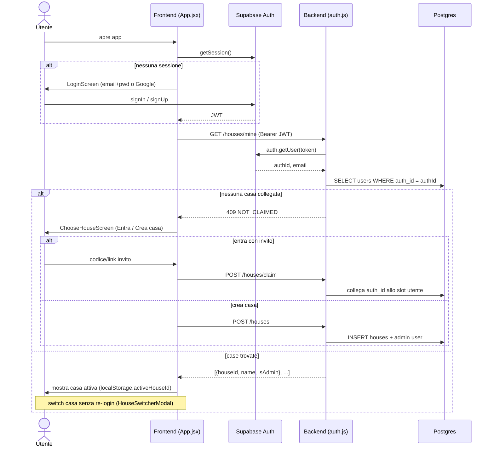
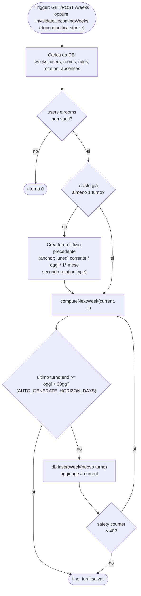
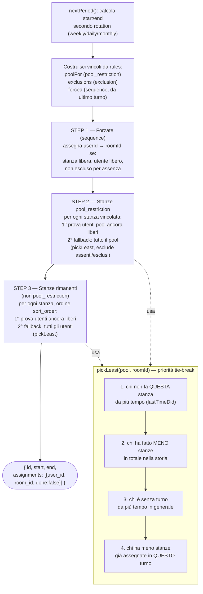
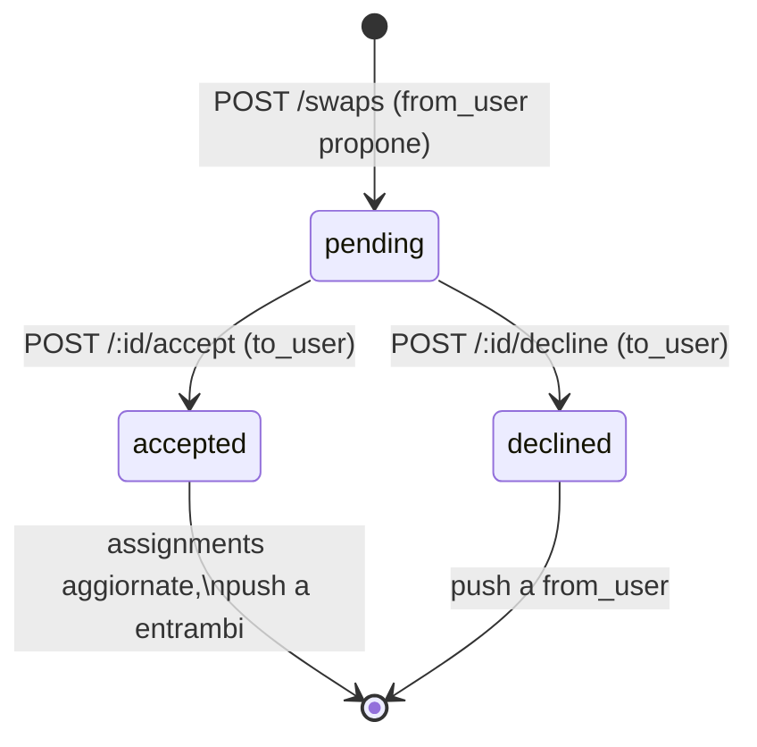
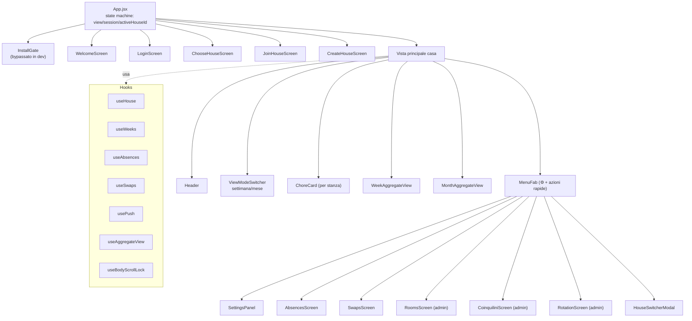
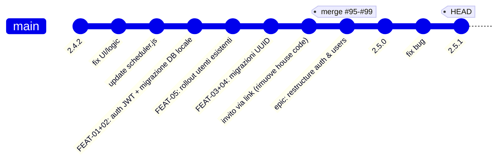
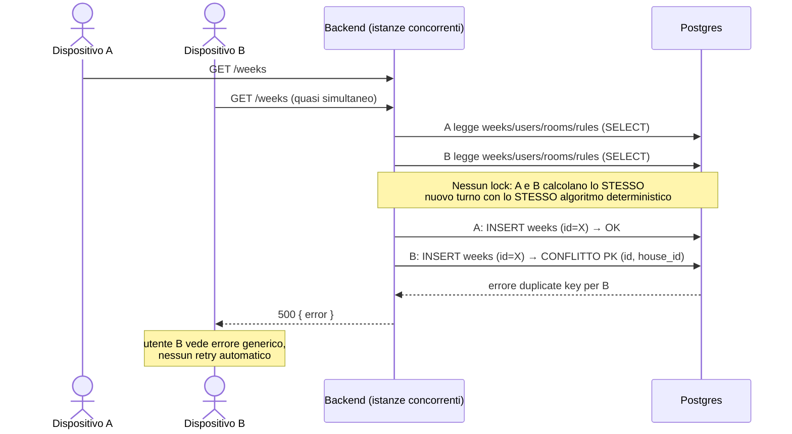

# Il Cencio · Turni di Casa — Stato del progetto

> Documento generato il 2026-08-19 dall'analisi diretta del codice sorgente (backend, frontend, schema DB, migrazioni, git log). Riflette lo stato del branch `develop` al commit `5fe9293` (versione **2.5.1**).

---

## 1. Panoramica

Web app PWA per gestire i turni di pulizia settimanali in case condivise multi-tenant ("case"). Ogni casa configura stanze, coinquilini e regole di assegnazione; un algoritmo genera automaticamente il calendario dei turni.

| Layer | Tecnologia | Percorso |
|---|---|---|
| Frontend | React 18 + Vite 6 + Tailwind CSS v4 | `frontend/` |
| Backend | Node.js (ESM) + Express 4 | `backend/` |
| DB / Auth | Supabase (Postgres + Supabase Auth) | `supabase/` |
| Hosting frontend | Netlify (SPA redirect, no-cache su `sw.js`) | `netlify.toml` |
| Push | Web Push (VAPID) | `backend/lib/push.js`, `frontend/src/hooks/usePush.js` |
| Cron | `node-cron` (reminder giornalieri, pulizia assenze) | `backend/lib/reminders.js`, `backend/lib/absenceCleanup.js` |

---

## 2. Architettura

---

## 3. Modello dati (schema live, post-migrazioni UUID)

⚠️ Nota importante: `backend/supabase_schema_v2.sql` + `supabase_migration_003..009` sono lo **storico** di come lo schema è stato costruito (PK intere/seriali). Le migrazioni in `supabase/migrations/` (applicate via Supabase CLI, non ancora "appiattite" in un unico schema committato) hanno **sostituito tutte le PK/FK con UUID** e introdotto la tabella `invites`. Lo schema sotto riflette lo stato **attuale** (dopo `20260810180300_swap_primary_keys.sql`).

**Row Level Security**: attivata su tutte le tabelle (`20260811100000_enable_rls.sql`), senza policy dedicate — funziona solo perché il backend accede con `service_role` key (bypassa RLS). Il vero cancello di autorizzazione resta il middleware Express (`requireAuth`/`requireMembership`/`requireAdmin`), non RLS — decisione esplicitamente documentata in `backend/supabase_fix_disable_rls.sql`.

---

## 4. API Backend

Base path: `/api`. Tutte le route sotto `/houses/:houseId/*` passano da `requireAuth` → `requireMembership` (risolve `(auth_id, houseId)` → `userId`, `isAdmin`); le mutazioni admin aggiungono `requireAdmin`.

| Router | Metodo | Path | Auth | Note |
|---|---|---|---|---|
| houses | POST | `/houses/lookup` | pubblico | risolve nome casa da invito |
| houses | GET | `/houses/:houseId/members` | pubblico | lista membri (per join screen) |
| houses | GET | `/houses/invites/:token` | pubblico | dettaglio invito |
| houses | POST | `/houses/claim` | requireAuth | collega identità auth a uno slot utente |
| houses | GET | `/houses/mine` | requireAuth | tutte le case dell'identità |
| houses | POST | `/houses` | requireAuth | crea nuova casa |
| houses | GET | `/houses/:houseId` | requireAuth+Membership | dettaglio casa (users/rooms/rules) |
| houses | PUT | `/houses/:houseId/rotation` | +Admin | tipo rotazione turni |
| houses | POST | `/houses/:houseId/invites` | +Admin | genera invito (token+QR) |
| houses | POST | `/houses/:houseId/users` | +Admin | crea slot coinquilino |
| houses | DELETE | `/houses/:houseId/users/:userId` | +Admin | rimuove coinquilino |
| houses | POST | `/houses/:houseId/leave` | requireAuth+Membership | abbandona casa |
| houses | POST/PUT/DELETE | `/houses/:houseId/rooms[/:roomId]` | +Admin | CRUD stanze |
| houses | POST/PUT/DELETE | `/houses/:houseId/rules[/:ruleId]` | +Admin | CRUD regole assegnazione |
| houses | POST/DELETE | `/houses/:houseId/push/subscribe` | requireAuth+Membership | subscribe/unsubscribe push |
| weeks | GET | `/houses/:houseId/weeks` | requireAuth+Membership | genera (se serve) e ritorna settimane |
| weeks | POST | `/houses/:houseId/weeks` | requireAuth+Membership | forza generazione |
| weeks | PATCH | `/houses/:houseId/weeks/:weekId/done` | requireAuth+Membership | segna/smarca task fatto |
| absences | GET/POST/PUT/DELETE | `/houses/:houseId/absences[/:absenceId]` | requireAuth+Membership | CRUD assenze |
| swaps | GET | `/houses/:houseId/swaps` | requireAuth+Membership | lista scambi |
| swaps | POST | `/houses/:houseId/swaps` | requireAuth+Membership | propone scambio |
| swaps | POST | `/houses/:houseId/swaps/:swapId/accept` | requireAuth+Membership | accetta |
| swaps | POST | `/houses/:houseId/swaps/:swapId/decline` | requireAuth+Membership | rifiuta |
| — | GET | `/api/health` | pubblico | healthcheck |

---

## 5. Flusso di autenticazione e appartenenza casa

Un'identità Supabase può appartenere a **più case** (`auth_id` NON unique dalla migrazione 009); l'appartenenza è sempre risolta per la coppia `(auth_id, houseId)`, mai per `auth_id` da solo.

---

## 6. Algoritmo di generazione turni (`backend/lib/scheduler.js`)

- Genera automaticamente le settimane/periodi mancanti fino a coprire un orizzonte di **`AUTO_GENERATE_HORIZON_DAYS = 30` giorni** da oggi, indipendentemente dal tipo di rotazione.
- Rotazione configurabile per casa: `weekly` (7gg), `daily` (N giorni custom), `monthly` (calendario).
- Regole applicate in generazione:
  - **pool_restriction** — solo un sottoinsieme di persone può fare una stanza
  - **sequence** — chi fa stanza A una settimana fa automaticamente la stanza B collegata quella dopo
  - **exclusion** — una persona non fa mai una certa stanza
- Le stanze non vincolate ruotano per "meno recentemente assegnato".
- **Esclusione per assenza**: una persona è esclusa dal turno se la sua assenza copre più del `ABSENCE_EXCLUSION_THRESHOLD = 0.75` (75%) della durata del periodo.
- **Ricalcolo automatico**: ogni modifica a stanze (creazione/rimozione) invalida le settimane non ancora concluse, rigenerate da capo alla prossima chiamata — evita calendari con assegnazioni orfane/mancanti.

### 6.1 Flusso di generazione (`ensureFutureWeeks`)

### 6.2 Assegnazione per singolo turno (`computeNextWeek`)

---

## 7. Scambio turni (feature "swap")

Due varianti:
1. **Scambio reciproco** — `to_room_id` valorizzato: due coinquilini si scambiano una stanza assegnata nella settimana corrente.
2. **Regalo/trasferimento a senso unico** — `to_room_id = NULL` (migrazione 007): una persona dà una stanza a chi non ha turni quella settimana, senza nulla in cambio.

Notifiche push a ogni passaggio (proposta, accettazione, rifiuto). Su Chrome/Edge (Android e desktop) la notifica di richiesta ha bottoni azionabili "Accetta"/"Rifiuta" direttamente sulla notifica (via `PUBLIC_API_URL` richiamato dal service worker); su Safari iOS resta solo cliccabile per aprire l'app (deep link `?swap=`).

---

## 8. Struttura frontend

Note tecniche rilevanti:
- **PWA obbligatoria in produzione**: `InstallGate.jsx` blocca l'accesso da browser normale finché non installata su home screen (bypass automatico in `npm run dev` via `import.meta.env.DEV`).
- **Rollout legacy**: `hasLegacySession()` rileva sessioni pre-FEAT-01/02 (PIN-based, chiavi `houseId/userId/...` in localStorage) e mostra `UpgradeNoticeScreen` invece della welcome normale.
- **Deep link invito**: `/join/:token` catturato sincronamente prima del gate di installazione, persistito in `localStorage.pendingInviteToken`, ripreso dopo installazione/riapertura.
- Unico dato persistito lato client: `activeHouseId` — tutto il resto (identità, elenco case) viene da sessione Supabase + `GET /houses/mine`, mai da cache locale non verificata.

---

## 9. Notifiche push — eventi coperti

| Evento | Trigger |
|---|---|
| Settimana con turni propri generata | scheduler / caricamento app |
| Reminder giornaliero task non fatti | cron `reminders.js` @ 9:00 |
| Turno non completato il giorno dopo fine settimana | cron `reminders.js` |
| Nuova assenza registrata da coinquilino | route `absences.js` |
| Richiesta / accettazione / rifiuto scambio turno | route `swaps.js` |
| Nuova versione app disponibile | `versionNotifier.js` confronta `backend/package.json` vs tabella `app_meta` a ogni avvio backend |

Requisiti iOS: Safari 16.4+ e app installata da home screen (Web Push non funziona da Safari diretto).

---

## 10. Versioning & deploy

- Versione corrente: **2.5.1** (`backend/package.json`, `frontend/package.json` allineati).
- Aggiornamento PWA in-place: service worker fa `skipWaiting`/`clients.claim` a ogni nuova versione; il client rileva il cambio e si ricarica una volta sola.
- Deploy frontend: Netlify, build da `frontend/`, redirect SPA `/* → /index.html`, `sw.js` sempre `no-cache`.
- Deploy backend: hosting separato (es. Railway), variabili d'ambiente da pannello servizio (stesse di `.env`).
- **Workflow locale** (obbligatorio per sviluppo/test, mai contro produzione): Supabase CLI (`supabase init` / `supabase start`, Studio locale su `:54323`), nuove migrazioni in `supabase/migrations/` applicate con `supabase db reset`; push verso produzione è passo manuale separato a fine lavoro.

---

## 11. Storia evolutiva recente (da git log)

Ultimi commit (`develop`), dal più recente:

L'epic **"restructure-authentication-and-users"** (FEAT-01 → FEAT-06) ha portato:
1. **FEAT-01** — sessioni JWT via Supabase Auth, middleware Express (`requireAuth`/`requireMembership`/`requireAdmin`), sostituendo il vecchio PIN a 4 cifre.
2. **FEAT-02 / US-02.5** — multi-casa per identità: un utente Supabase può appartenere a più case, switch senza re-login (rimosso vincolo unique su `auth_id`).
3. **FEAT-03 / FEAT-04** — migrazione di tutte le PK/FK da interi/slug a UUID (colonne additive → backfill → swap finale in transazione unica).
4. **FEAT-05** — rollout per utenti esistenti pre-migrazione (schermata `UpgradeNoticeScreen`).
5. **FEAT-06** — invito via link+QR (tabella `invites`), in sostituzione del vecchio `house_invite_code`/`users.invite_code` (colonne legacy non ancora rimosse — rimozione pianificata come US-06.5 separato).
6. Difesa in profondità: **RLS abilitata** su tutte le tabelle (il middleware Express resta il vero cancello di autorizzazione; il backend usa `service_role` key per bypassarla).

---

## 12. Debiti tecnici / note aperte rilevate nel codice

- `users.pin_hash` (autenticazione legacy) non ancora rimossa: in attesa di verifica completa rollout utenti esistenti (FEAT-05/US-01.5).
- `house_invite_code` / `users.invite_code` legacy non ancora rimosse, in attesa di US-06.5.
- `backend/supabase_schema_v2.sql` + migrazioni `003`-`009` (nella cartella `backend/`) descrivono uno schema **intero/slug-based** ormai superato dalle migrazioni UUID in `supabase/migrations/`: chi esegue setup da zero seguendo il README arriva a uno schema diverso da quello live in produzione, finché non applica anche le migrazioni CLI più recenti. Andrebbe valutato un riallineamento/flattening dello schema committato.
- RLS attiva senza policy dichiarate: sicura solo finché il backend usa esclusivamente `service_role` key — un eventuale uso futuro della `anon` key lato server romperebbe silenziosamente tutte le query.

---

## 13. Lacune e rischi — uso live multi-dispositivo / multi-persona

Analisi mirata: cosa succede quando **più coinquilini, su dispositivi diversi, usano l'app nello stesso momento**. L'app non ha transazioni DB, non ha lock, non ha realtime — ogni rischio sotto nasce da questa combinazione.

### 13.1 Nessun realtime — solo sync "a scatti"

Il README dichiara il done-check "condiviso in tempo reale", ma **non esiste alcun canale realtime/websocket/polling** (nessun `supabase.channel()`, nessun `setInterval`). I dati si aggiornano solo in questi momenti (`frontend/src/App.jsx:155-229`):

- caricamento iniziale dell'app;
- `visibilitychange` (tab torna in foreground);
- arrivo di una notifica push che apre/mette a fuoco l'app;
- deep link `?swap=`.

**Rischio concreto**: due coinquilini con l'app aperta in background contemporaneamente non vedono le modifiche l'uno dell'altro (nuovo turno generato, task segnato fatto, assenza inserita, scambio proposto) finché non tornano in foreground o ricevono una push. Su iOS in particolare le push actionable non funzionano (§9) e i service worker in background sono meno affidabili — la finestra di disallineamento è più lunga.

### 13.2 Race condition sulla generazione turni (doppio dispositivo = errore)

`GET /weeks` chiama sempre `ensureFutureWeeks` prima di rispondere (`backend/routes/weeks.js:26-34`) — è lo scenario **più comune in assoluto**: casa con più persone, ognuna apre l'app la mattina.

- Non è corruzione dati (la PK `(id, house_id)` su `weeks` salva da un doppio turno), ma è un **errore 500 esposto all'utente** in una situazione normalissima d'uso. `useWeeks.js` non fa retry: l'errore arriva a `showToast(e.message, 'error')` in `App.jsx:158`, mostrando un messaggio tecnico Postgres crudo.
- Stesso pattern per `invalidateUpcomingWeeks` (route `absences.js`) in corsa con `ensureFutureWeeks`: un dispositivo può cancellare le settimane proprio mentre un altro le sta generando, causando assignment persi o rigenerazioni ripetute.
- `insertWeek` (`backend/lib/db.js`) fa **due insert separati** (weeks, poi assignments) senza transazione: se il secondo fallisce (es. crash di rete a metà), resta un turno con **zero assegnazioni** visibile a tutti finché qualcosa non lo rigenera.

### 13.3 Scambio turni: non atomico, doppio-accept possibile

`swapAssignments` (`backend/lib/db.js`) esegue **DELETE poi INSERT** come due chiamate Supabase separate, senza transazione:
- se il processo backend muore/erra tra le due chiamate, l'assegnazione viene **cancellata e mai reinserita** — un task sparisce dal calendario di entrambi i coinquilini, nessuno lo fa più finché non se ne accorgono.

`POST /swaps/:id/accept` (`backend/routes/swaps.js:70-94`) verifica `status !== 'pending'` e poi, **in una chiamata separata**, aggiorna lo status — classico **TOCTOU**: se il destinatario preme "Accetta" da due dispositivi (es. telefono + tablet aperti insieme) quasi simultaneamente, entrambe le richieste possono superare il controllo `pending` prima che una delle due scriva `accepted`, causando `swapAssignments` eseguito **due volte** sulla stessa coppia di assegnazioni → seconda esecuzione trova le stanze già spostate, il filtro DELETE non matcha più nulla, risultato incoerente (stanza duplicata o persa a seconda dell'ordine).

### 13.4 Claim di uno slot coinquilino: race silenziosa, nessun errore

`claimUserSlotByAuth` (`backend/lib/db.js`) fa **SELECT (controlla `auth_id` nullo) → UPDATE** come due passi separati, non atomici. Se due identità diverse (es. invito casa condiviso via chat di gruppo, due persone cliccano "sono io" sullo stesso slot quasi insieme) tentano il claim dello stesso slot:
- entrambe passano il controllo "non ancora collegato";
- **l'ultima UPDATE vince silenziosamente** — non c'è unique constraint che lo impedisca (`auth_id` non è più unique dalla migrazione 009, di proposito, per il multi-casa);
- la prima persona **perde l'accesso** al proprio slot senza errore visibile, finché non prova a fare login e si ritrova con `NOT_CLAIMED` o legata a un'identità sbagliata.

### 13.5 Notifiche/cron duplicati se il backend scala oltre 1 istanza

`startReminderCron()` (`node-cron`) e `notifyIfNewVersion()` girano **in-process**, senza lock distribuito. Con una singola istanza backend (setup attuale presumibile) non è un problema; ma è un rischio esplicito per qualunque scaling orizzontale futuro (es. Railway con più repliche):
- ogni istanza pianifica il proprio cron alle 9:00 → reminder giornalieri e "turno non completato" **duplicati** una volta per istanza attiva;
- `notifyIfNewVersion()` fa `getAppMeta` → confronto → `setAppMeta` senza lock: due istanze avviate insieme dopo un deploy possono entrambe leggere la vecchia versione prima che una scriva la nuova, inviando la notifica di aggiornamento **due volte a tutte le case**.

### 13.6 Altri punti deboli rilevanti per uso condiviso

| # | Rischio | File | Impatto |
|---|---|---|---|
| 1 | `cors()` senza whitelist di origin: qualunque sito può fare richieste cross-origin verso l'API (mitigato da auth Bearer JWT, ma nessuna difesa aggiuntiva) | `backend/index.js:12` | Basso-medio |
| 2 | `toggleDone` è ottimistico senza conflict detection: due persone che segnano/smarcano lo stesso task quasi insieme non ricevono alcun avviso di conflitto, vince l'ultimo PATCH silenziosamente | `frontend/src/hooks/useWeeks.js` | Basso (UX, non dati) |
| 3 | Nessun rate limiting su nessuna rotta (login escluso, gestito da Supabase Auth) — `POST /houses/claim`, `/invites`, ecc. sono chiamabili senza limiti da chi ha un JWT valido | `backend/index.js`, tutte le routes | Medio |
| 4 | `house_invite_code` / `users.invite_code` legacy (§12) restano **attivi e non scadono mai**, in parallelo al nuovo sistema `invites` con TTL 30gg — due meccanismi di accesso casa coesistono, uno senza scadenza | `backend/lib/db.js: lookupHouseByCode` | Medio (superficie invito più ampia del previsto) |
| 5 | Errori Postgres grezzi (es. violazione PK, messaggi in inglese/tecnici) propagati as-is in `{ error: e.message }` su ogni rotta — nessuna mappatura a messaggi utente, nessun retry automatico lato frontend per i 500 | tutte le `routes/*.js` | Basso (UX) |
| 6 | `ABSENCE_EXCLUSION_THRESHOLD = 0.75` e `AUTO_GENERATE_HORIZON_DAYS = 30` sono costanti hardcoded, non configurabili per casa — comportamento non personalizzabile senza redeploy | `backend/lib/scheduler.js:5,20` | Basso |

### 13.7 Priorità consigliate per la ristrutturazione

1. **Alta** — rendere `insertWeek` e `swapAssignments` atomici (transazione Postgres via RPC/funzione SQL, non due chiamate Supabase separate) — previene perdita di assegnazioni.
2. **Alta** — introdurre un lock (es. `SELECT ... FOR UPDATE` via RPC, o un vincolo/upsert idempotente) attorno a `ensureFutureWeeks` e al claim slot, per eliminare le race di §13.2 e §13.4.
3. **Media** — introdurre uno strato realtime (Supabase Realtime su `weeks`/`assignments`/`shift_swaps`/`absences`) per sostituire il sync "a scatti" di §13.1, requisito reale per un'app multi-utente live.
4. **Media** — lock distribuito o singolo "cron owner" (es. flag in `app_meta` con TTL) prima di abilitare più istanze backend.
5. **Bassa** — whitelisting CORS, rate limiting, mappatura errori utente-friendly.
